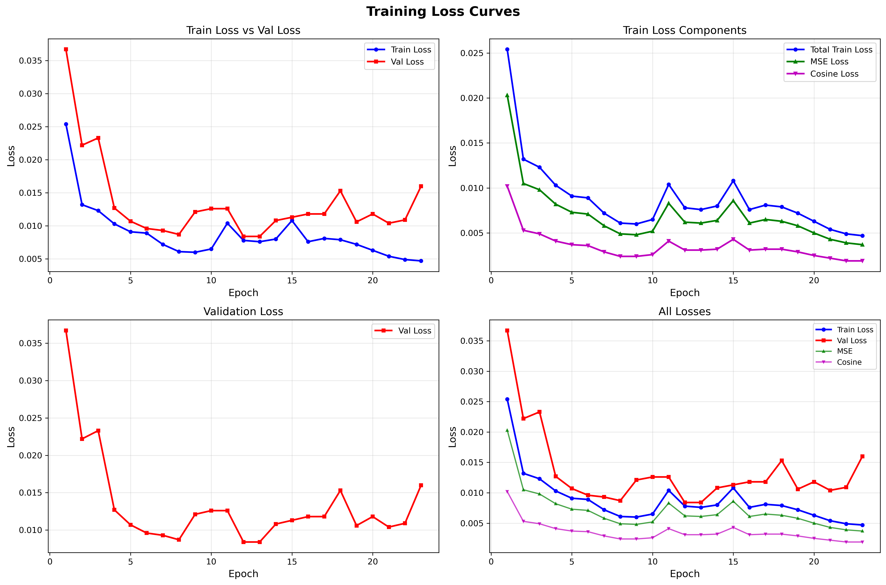
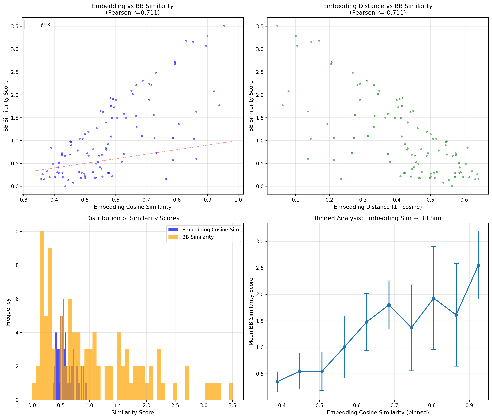
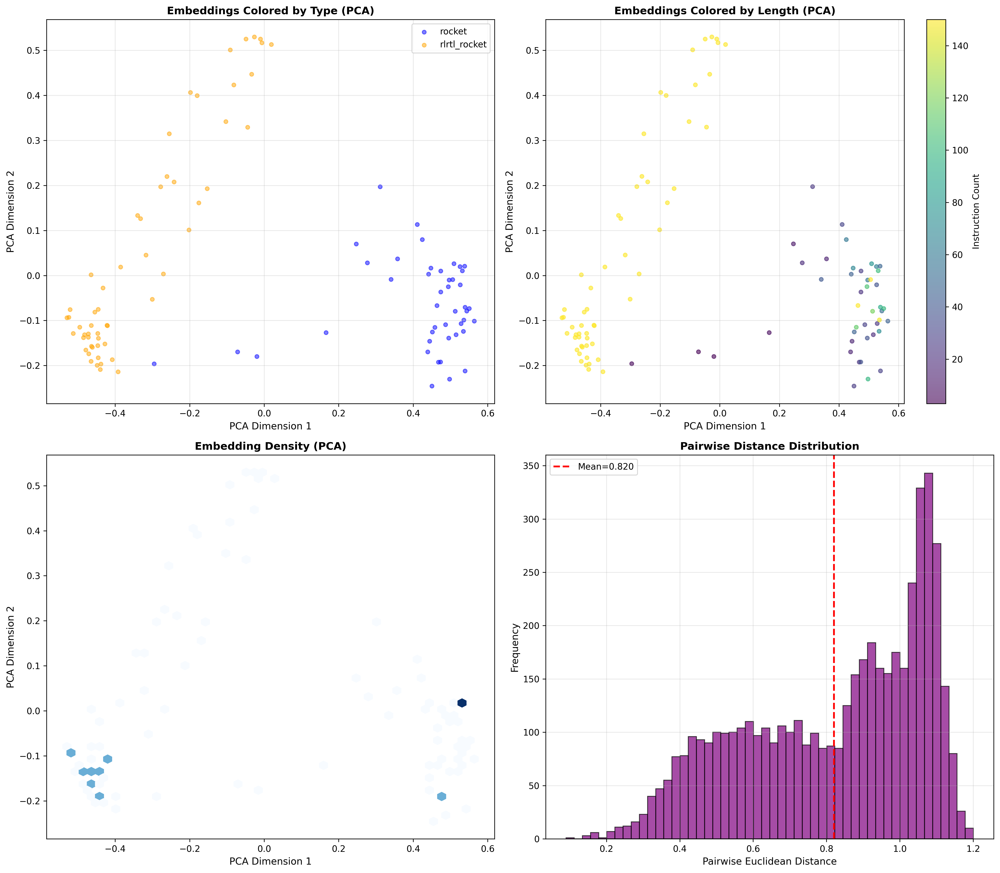

# BBencoder — RISC-V Assembly Encoder

**Author:** ywangmu from HKUST

面向 RISC-V 汇编代码的深度学习编码器项目，支持多种模型架构和训练任务。

---

## 项目特性
- 当前使用Model在 BBencoder/lstm_stage2 目录下
- 🏗️ **多种模型架构**：LSTM、BabyGPT (小型 Transformer)、GPT-2 (完整 Transformer)
- 🎯 **多种训练任务**：MLM 预训练、监督相似度学习、分类任务
- 🔄 **迁移学习支持**：MLM 预训练 → 监督学习微调
- 📊 **完整评估工具**：BB 相似度计算、Embedding 相关性分析
- 🚀 **统一训练接口**：一个脚本支持所有模型和任务

---

## 目录结构

```
BBencoder/
├── README.md                          # 本文档（统一文档）
│
├── models_arch/                       # 模型架构实现
│   ├── __init__.py                    # 模块导入
│   ├── lstm_encoder.py                # 统一 LSTM 编码器（支持多任务）
│   ├── babygpt.py                     # 小型 Transformer (4层, 256维)
│   └── gpt2.py                        # 完整 GPT-2 (12层, 768维)
│
├── trainers/                          # 训练脚本（旧版）
│   ├── __init__.py
│   └── train_mlm.py                   # MLM 训练脚本（支持多模型）
│
├── train.py                           # 🚀 统一训练脚本（推荐）
├── demo.sh                            # 快速测试脚本
├── train_unified.sh                   # 完整训练脚本
│
├── advanced_tokenizer.py              # RISC-V 汇编 Tokenizer
├── bbtokenizer_mlm_dataset.py         # MLM 数据集
├── evaluate_bb_similarity.py          # BB 相似度计算
├── evaluate_embedding_correlation.py  # Embedding 相关性评估
│
├── train_encoder_mlm.py               # MLM 训练（旧版，仅 LSTM）
├── train_full_model_supervised.py     # 监督学习训练（旧版）
│
├── demo_mlm.sh                        # LSTM MLM 快速测试（旧版）
├── demo_transformers.sh               # Transformer 快速测试（旧版）
├── train_mlm.sh                       # MLM 完整训练（旧版）
├── train.sh                           # Supervised 完整训练（旧版）
│
└── dataset/                           # 数据集目录
    └── final_training_data.pkl        # 训练数据（50,749 samples）
```

**推荐使用：**
- ✅ `train.py` + `demo.sh` + `train_unified.sh`（统一接口）
- ⚠️ 旧版脚本保留用于向后兼容

---

## 快速开始

### 1. 安装依赖

```bash
# PyTorch (根据你的 CUDA 版本调整)
pip install torch torchvision torchaudio --index-url https://download.pytorch.org/whl/cu118

# 其他依赖
pip install numpy scipy matplotlib tqdm
```

### 2. 快速测试（Demo 模式）

使用统一训练脚本进行快速验证：

```bash
# 测试 LSTM + MLM
bash demo.sh lstm mlm

# 测试 LSTM + Supervised
bash demo.sh lstm supervised

# 测试 BabyGPT + MLM
bash demo.sh babygpt mlm

# 测试 GPT-2 + MLM
bash demo.sh gpt2 mlm
```

**Demo 模式特点：**
- ✅ 自动限制样本数量（20个）
- ✅ 快速训练（3轮）
- ✅ 小批量（batch=4）
- ✅ 验证代码正确性

### 3. 完整训练（Train 模式）

```bash
# LSTM + MLM 预训练
bash train_unified.sh lstm mlm

# LSTM + Supervised 训练
bash train_unified.sh lstm supervised

# BabyGPT + MLM 预训练
bash train_unified.sh babygpt mlm

# GPT-2 + MLM 预训练
bash train_unified.sh gpt2 mlm
```

### 4. Python 脚本直接调用

```bash
# MLM 预训练
python3 train.py \
  --model lstm \
  --task mlm \
  --mode train \
  --num-samples 5000 \
  --epochs 50 \
  --batch-size 32 \
  --device cuda

# Supervised 训练
python3 train.py \
  --model lstm \
  --task supervised \
  --mode train \
  --num-samples 20000 \
  --epochs 100 \
  --batch-size 64 \
  --enable-dep \
  --device cuda
```

---

## 模型架构

### 统一的 LSTM 编码器

`LightweightLSTMEncoder` 是一个灵活的 LSTM 编码器，通过 `task` 参数支持多种训练任务：

```python
from models_arch import LightweightLSTMEncoder

# MLM 预训练
mlm_model = LightweightLSTMEncoder(
    vocab_size=343, 
    embed_dim=64, 
    hidden_dim=128, 
    task='mlm'
)

# 监督相似度学习
sup_model = LightweightLSTMEncoder(
    vocab_size=343, 
    embed_dim=64, 
    hidden_dim=128, 
    output_dim=32,
    task='supervised'
)

# 分类任务
clf_model = LightweightLSTMEncoder(
    vocab_size=343, 
    embed_dim=64, 
    hidden_dim=128, 
    task='classification',
    num_classes=10
)
```

**核心设计理念：**
- ✅ **共享 LSTM Backbone**：所有任务共用相同的编码器（Embedding + BiLSTM + Attention）
- ✅ **任务特定输出头**：根据任务自动配置不同的输出层
- ✅ **灵活切换**：支持 `switch_task()` 方法进行迁移学习

### Transformer 架构详细对比

#### BabyGPT vs GPT-2 核心差异

两个模型采用**完全相同的架构设计**，差异仅在**规模参数**上：

| 配置项 | BabyGPT | GPT-2 | 缩放比例 |
|--------|---------|-------|---------|
| **层数** (`n_layer`) | 4 | 12 | **3×** |
| **注意力头数** (`n_head`) | 4 | 12 | **3×** |
| **嵌入维度** (`n_embd`) | 256 | 768 | **3×** |
| **最大序列长度** | 512 | 1024 | **2×** |
| **MLP 隐藏层** | 4×256=1024 | 4×768=3072 | **3×** |
| **是否使用 Bias** | ❌ False | ✅ True | - |
| **参数量** | 3.37M | 85.68M | **~25×** |

**共同的架构组件：**
- ✅ 双向 Self-Attention（非因果，适配 MLM）
- ✅ Pre-LayerNorm 结构（更稳定的训练）
- ✅ GELU 激活函数
- ✅ Residual Connection + Dropout
- ✅ Weight Tying（Token Embedding 与 MLM Head 共享）
- ✅ Flash Attention 支持（PyTorch ≥ 2.0）
- ✅ Self-Attention Pooling（Supervised 任务）

#### 参数量分解

**BabyGPT (3.37M 参数):**
```
Embeddings:
├── Token Embedding:    350 × 256    = 89,600
└── Position Embedding: 512 × 256    = 131,072

Single Transformer Block (~787K):
├── LayerNorm 1:        256 × 2      = 512
├── Self-Attention:
│   ├── c_attn (Q,K,V): 256 × 768    = 196,608
│   └── c_proj:         256 × 256    = 65,536
├── LayerNorm 2:        256 × 2      = 512
└── MLP:
    ├── c_fc:           256 × 1024   = 262,144
    └── c_proj:         1024 × 256   = 262,144

4 Transformer Blocks:   4 × 787K     = ~3.15M
Final LayerNorm:                     = 512
MLM Heads:              (shared)     = 0

Total: ~3.37M parameters
```

**GPT-2 (85.68M 参数):**
```
Embeddings:
├── Token Embedding:    350 × 768    = 268,800
└── Position Embedding: 1024 × 768   = 786,432

Single Transformer Block (~7.08M):
├── LayerNorm 1:        768 × 2      = 1,536
├── Self-Attention:
│   ├── c_attn + bias:  768 × 2304   = 1,771,776
│   └── c_proj + bias:  768 × 768    = 590,592
├── LayerNorm 2:        768 × 2      = 1,536
└── MLP:
    ├── c_fc + bias:    768 × 3072   = 2,362,368
    └── c_proj + bias:  3072 × 768   = 2,360,064

12 Transformer Blocks:  12 × 7.08M   = ~85M
Final LayerNorm:                     = 1,536
MLM Heads:              (shared)     = 0

Total: ~85.68M parameters
```
---

## Tokenizer 介绍

### AdvancedRISCVTokenizer

结构化的 RISC-V 汇编 tokenizer，提供语义级别的标注：

**特性：**
- 🏷️ **结构化标注**：`<s>`, `</s>`, `<dsts>`, `<srcs>`, `<mem>`, `<addr>`, `<csr>`, `<const>`, `;`
- 🔧 **执行单元元数据**：为每个操作码维护执行单元信息（INT_ALU, LOAD, BRANCH 等）
- 📦 **CSR 支持**：自动映射 CSR 地址到名称（如 `0x300` → `mstatus`）
- 🎯 **高覆盖率**：词汇表 343 个 token，100% 覆盖 RISC-V 指令

**示例：**
```python
tokenizer = AdvancedRISCVTokenizer()

# 普通指令
tokens = tokenizer.tokenize_instruction("addi x1, x2, 100")
# ['<s>', 'ADDI', '<dsts>', 'x1', ';', '<srcs>', 'x2', ';', '<const>']

# 访存指令
tokens = tokenizer.tokenize_instruction("lw x4, 0(sp)")
# ['<s>', 'LW', '<dsts>', 'x4', ';', '<srcs>', '<mem>', 'sp', ';', '<const>', '</mem>']

# CSR 指令
tokens = tokenizer.tokenize_instruction("csrrs x0, mstatus, x28")
# ['<s>', 'CSRRS', '<dsts>', 'x0', ';', '<csr>', 'mstatus', ';', '<srcs>', 'x28']
```

---

## 训练任务详解

### 1. MLM (Masked Language Modeling)

**自监督预训练任务**，不需要标签数据。

**双层 MLM 目标：**
- **Token-level MLM**：随机 mask 15% 的 token，预测原始 token
- **Instruction-level MLM**：随机 mask 15% 的完整指令，预测整条指令

**优势：**
- ✅ 不需要标注数据
- ✅ 可以利用大量未标注的汇编代码
- ✅ 学习到的表示可以迁移到下游任务

**示例：**
```bash
# 使用 LSTM
bash demo_mlm.sh

# 使用 BabyGPT
bash demo_transformers.sh
```

### 2. Supervised Similarity Learning

**监督学习任务**，使用 BB 相似度作为监督信号。

**训练目标：**
- 使 embedding 的余弦相似度与 BB 相似度对齐
- 损失函数：MSE Loss + Smooth L1 Loss

**BB 相似度计算：**
- 加权 LCS (Longest Common Subsequence)
- 执行单元感知的指令评分
- 可选：局部数据依赖一致性奖励

**示例：**
```bash
python train_full_model_supervised.py \
  --num-samples 1000 \
  --epochs 50 \
  --num-pairs 5 \
  --enable-dep
```

## 两阶段训练策略（Pre-training + Fine-tuning）

### 核心理念

**阶段一：MLM 预训练（语义和语法学习）**
- 🎯 **目标**：学习 RISC-V 汇编的语义结构、指令模式和语法规则
- 📚 **数据**：利用大量无标注的汇编代码（50K+ samples）
- 🔄 **任务**：Token-level + Instruction-level 双层 MLM
- ⚡ **效果**：模型学会理解指令含义、寄存器使用模式、数据流等

**阶段二：Supervised 微调（相似度对齐）**
- 🎯 **目标**：将 BB embedding 对齐到 BB 相似度空间
- 📊 **数据**：使用计算好的 BB 相似度标签（需要的数据量较少）
- 🎓 **任务**：Contrastive learning，使相似 BB 的 embedding 靠近
- 🚀 **效果**：快速收敛，embedding 具有更好的判别性

## 评估工具

### 1. BB 相似度计算

```bash
python evaluate_bb_similarity.py \
  --random \
  --enable-dep \
  --dep-window 3 \
  --normalize maxlen
```

**参数说明：**
- `--random`: 随机选择两个 BB 进行比较
- `--enable-dep`: 启用依赖一致性奖励
- `--dep-window`: 依赖匹配窗口大小
- `--normalize`: 归一化方式（`maxlen`, `avglen`, `none`）

### 2. Embedding 相关性分析

```bash
python evaluate_embedding_correlation.py \
  --model models_supervised/best_model.pt \
  --tokenizer models_supervised/tokenizer.pkl \
  --num-pairs 500 \
  --num-samples 2000
```

**输出：**
- `evaluation_results/embedding_correlation_analysis.png`：可视化图表
- `evaluation_results/statistics.txt`：统计数据
  - Pearson 相关系数
  - Spearman 相关系数
  - 散点图、直方图、分箱分析

---

## 统一训练脚本 (train.py)

### 概述

`train.py` 是BBencoder的统一训练接口，支持：
- ✅ **多模型**：LSTM, BabyGPT, GPT-2-Small, GPT-2
- ✅ **多任务**：MLM（自监督预训练）, Supervised（相似度学习）
- ✅ **多模式**：Demo（快速调试）, Train（完整训练）

## 模型维度流程

### LSTM Encoder (以 Supervised 任务为例)

```
输入 token IDs:     (B, L)             # B=batch_size, L=seq_len
    ↓
Embedding:          (B, L, embed_dim)  # embed_dim=192
    ↓
BiLSTM:             (B, L, 2×hidden)   # hidden=384, 双向=768
    ↓
Attention Pooling:  (B, 2×hidden)      # 加权求和，得到 768 维
    ↓
Output Projection:  (B, output_dim)    # output_dim=96
    ↓
L2 Normalization:   (B, output_dim)    # 归一化，用于余弦相似度
```

### Transformer (BabyGPT)

```
输入 token IDs:     (B, L)             # B=batch_size, L=seq_len
    ↓
Token Embedding:    (B, L, n_embd)     # n_embd=256
    + 
Position Embedding: (L, n_embd)
    ↓
Transformer Blocks: (B, L, n_embd)     # 4 layers, 4 heads
    ↓
MLM Head:           (B, L, vocab_size) # 预测每个位置的 token
```

---

## 可视化结果

### 训练损失曲线



### Embedding-BB 相关性分析



### Embedding 可视化 (PCA/t-SNE)




---