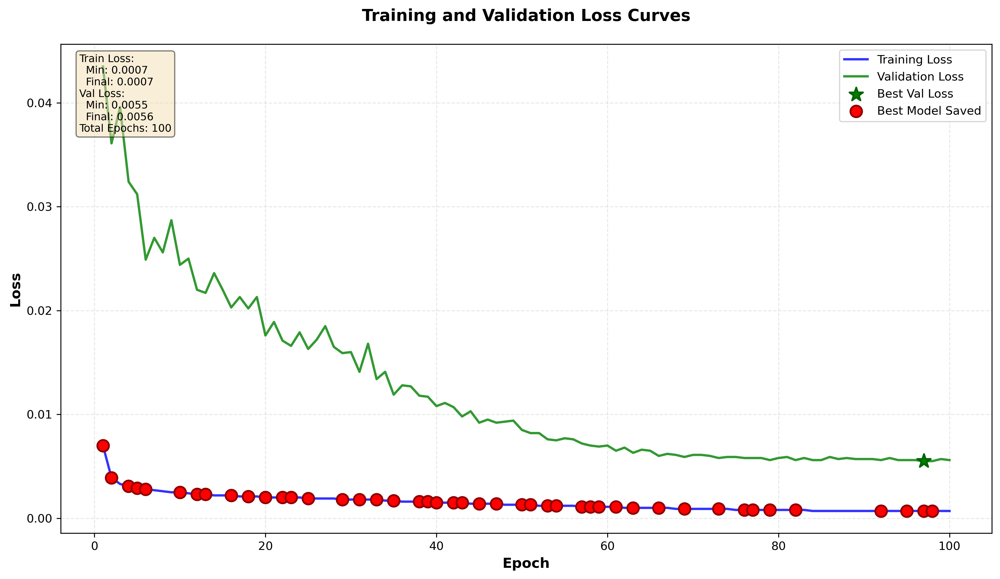

# BBencoder (Supervised) — RISC-V Testcase Encoder

面向RISC-V测试用例的序列编码器与评估工具，包含监督式训练与相关性评估：
- 使用基本块（BB）相似度作为监督信号训练编码器
- 提供 embedding 与 BB 相似度的相关性评估

---

## 目录结构（精简版）

```
BBencoder/
├── README.md
├── advanced_tokenizer.py                # 结构化 tokenizer（含执行单元信息 + 可选依赖sidecar）
├── lightweight_encoder_supervised.py    # 监督式 LSTM 编码器与训练函数
├── train_full_model_supervised.py       # 监督式训练入口脚本（命令行）
├── evaluate_bb_similarity.py            # 基本块相似度计算脚本
├── evaluate_embedding_correlation.py    # Embedding 与 BB 相似度相关性评估
├── scripts/
│   └── prepare_balanced_dataset.py      # 训练数据准备工具
└── dataset/
    └── final_training_data.pkl          # 训练/评估所需数据（用户自备）

# 训练输出（运行后生成）
models_supervised/
├── best_model.pt
└── tokenizer.pkl

evaluation_results/
├── embedding_correlation_analysis.png
└── statistics.txt
```

---

## 快速上手

1) 训练（监督式，使用BB相似度作为回归目标）

```bash
python3 train_full_model_supervised.py \
  --data /abs/path/to/final_training_data.pkl \
  --epochs 50 --batch-size 32 --device cuda
```

输出：`models_supervised/best_model.pt`, `models_supervised/tokenizer.pkl`

2) 评估：Embedding 与 BB 相似度相关性

```bash
python3 evaluate_embedding_correlation.py \
  --data /abs/path/to/final_training_data.pkl \
  --model models_supervised/best_model.pt \
  --tokenizer models_supervised/tokenizer.pkl \
  --num-pairs 500 --num-samples 2000 --device cuda
```

生成：`evaluation_results/embedding_correlation_analysis.png` 与统计文本

3) 单次BB相似度计算（可选）

```bash
python3 evaluate_bb_similarity.py --random --enable-dep --dep-window 3
```

---

## Tokenizer 介绍（AdvancedRISCVTokenizer）

- 结构化标注：使用 `<s>`, `</s>`, `<dsts>`, `<srcs>`, `<mem>...</mem>`, `<addr>...</addr>`, `<csr>`, `<const>`, `;` 等标记，将每条指令解析为结构化 token 序列，兼顾寄存器角色与访存/跳转模式。
- 执行单元元数据：为每个操作码维护 `exec_unit` 与 `exec_subclass` 元信息（如 INT_ALU/ARITH, LOAD/LOAD_W 等），用于更合理的指令级相似度评分与对齐。
- 可选依赖 sidecar：当启用 `enable_dependency_sidecar=True` 时，提供每条指令的依赖侧信息（来源寄存器是否为 use/ext、其定义位置等），供 BB 相似度的“依赖一致性奖励”使用。
- 词表覆盖：包含特殊标记、操作码、整型/浮点寄存器（编号与 ABI 名称）、常见 CSR 名称等；编码稳定、可直接在不同数据集间复用。

示例（指令到 tokens）：
```
ADDI x1, x2, 100
→ ['<s>', 'ADDI', '<dsts>', 'x1', ';', '<srcs>', 'x2', ';', '<const>']

LW x4, 0(sp)
→ ['<s>', 'LW', '<dsts>', 'x4', ';', '<srcs>', '<mem>', 'sp', ';', '<const>', '</mem>']
```

### CSR 指令的特别支持

- 专用标签：使用 `<csr>` 包裹 CSR 名称，确保 CSR 访问在 token 序列中有明确的语义位置。
- CSR 名称与地址映射：内置常见 CSR 名称；当出现十六进制地址（如 `0x300`）时，会自动映射到名称（如 `mstatus`），若无法识别则回退为 `<const>`，保持稳健。
- 立即数 zimm：对 `csrrwi/csrrsi/csrrci` 这类带 5-bit 立即数的 CSR 指令，将 zimm 归一化为 `zimm0`~`zimm31`，避免词表爆炸并保留位宽语义。
- 示例：
```
CSRRs x0, mstatus, x28
→ ['<s>', 'CSRRS', '<dsts>', 'x0', ';', '<csr>', 'mstatus', ';', '<srcs>', 'x28']

CSRRWI x1, 0x300, 0x1f
→ ['<s>', 'CSRRWI', '<dsts>', 'x1', ';', '<csr>', 'mstatus', ';', '<srcs>', 'zimm31']
```

依赖 sidecar（启用时）还会提供 CSR 指令的读/写端口信息，以便在 BB 对齐中对来源/定义关系做本地一致性检查。

---

## Encoder 模型介绍（LightweightSequenceEncoder）

- 架构：Embedding → 双向 LSTM（2 层）→ 注意力加权池化 → 全连接投影 → L2 归一化输出。
- 训练目标（监督式）：
  - 基于 BB 相似度的回归拟合（MSE）
  - 结合余弦相似度对齐（Smooth L1），鼓励“高 BB 相似度 → 高 embedding 相似度”。
- 默认维度（可通过训练脚本配置）：`embed_dim=192`, `hidden_dim=384`, `output_dim=96`。
- 推理：输出已 L2 归一化，直接用于余弦相似度；适合海量用例的快速近似检索或去重。

训练数据与监督信号：
- 从样本集中随机产生成对用例，使用加权 LCS + 执行单元感知的指令评分函数计算 BB 相似度；可选启用“局部数据依赖一致性奖励”。
- 将该分数作为监督信号，直接优化 embedding 与实际 BB 相似度的相关性。

### 逐层维度说明（批大小 B，序列长度 L）

- 输入 token 序列：`(B, L)`，每行是 tokenizer 产生的 ID 序列（截断到 `--max-length`）。
- Embedding 层输出：`(B, L, embed_dim)`。
- Bi-LSTM 输出：`(B, L, 2*hidden_dim)`（双向拼接）。
- 注意力打分：`(B, L, 1)`，softmax 后做加权求和。
- 注意力聚合后：`(B, 2*hidden_dim)`。
- 投影 MLP：`(B, hidden_dim)` → `(B, output_dim)`。
- L2 归一化：最终向量 `(B, output_dim)`，可直接做余弦相似度。

若提供长度张量（原始未 padding 的每样本长度），Bi-LSTM 将使用 packed sequence 提升效率并避免 padding 干扰。

---

## 训练与评估可视化

训练损失曲线：



Embedding 与 BB 相似度相关性（散点/直方/分箱分析等）：


---

## 关键脚本说明

- `lightweight_encoder_supervised.py`
  - `LightweightSequenceEncoder`: 轻量双向LSTM + 注意力 + L2归一化输出
  - 监督目标：最小化预测相似度与实际BB相似度的差异（回归损失 + 余弦对齐）
  - `train_supervised_encoder(...)`: 训练入口（被命令行脚本调用）

- `train_full_model_supervised.py`
  - 读取数据、划分训练/验证、计算成对BB相似度并训练；保存最优权重与 tokenizer

- `evaluate_bb_similarity.py`
  - 执行单元感知的指令相似度 + 加权LCS对齐；可选“局部数据依赖一致性”奖励

- `evaluate_embedding_correlation.py`
  - 随机抽取样本对，计算 embedding 相似度与 BB 相似度，输出统计与图表
  - 已默认使用 `models_supervised/` 下的模型与 tokenizer 路径

---

## 依赖与环境

- Python 3.8+
- PyTorch（GPU推荐）
- Numpy / Scipy / Matplotlib / Tqdm

示例安装（按需调整CUDA版本）：
```bash
pip3 install torch torchvision torchaudio --index-url https://download.pytorch.org/whl/cu118
pip3 install numpy scipy matplotlib tqdm
```

---

## 常用参数（训练脚本）

- `--epochs`（默认50）
- `--batch-size`（默认32）
- `--lr`（默认1e-3）
- `--max-length`（默认1600）
- `--num-pairs` 每个样本生成的随机配对数（默认5）
- `--normalize` BB相似度归一化方式：`maxlen|avglen|none`（默认maxlen）
- `--enable-dep` 是否启用依赖一致性奖励（默认关闭）

---

## 注意事项

- 评估脚本默认模型路径为 `models_supervised/`；如自定义输出，请对应传参
- 计算BB相似度开销与样本规模成正比；首次数据集配对会较慢
- 如遇CUDA显存压力，先下调 `--batch-size` 或缩小 `--num-samples`/`--num-pairs`

---

Author: ywangmu from HKUST

